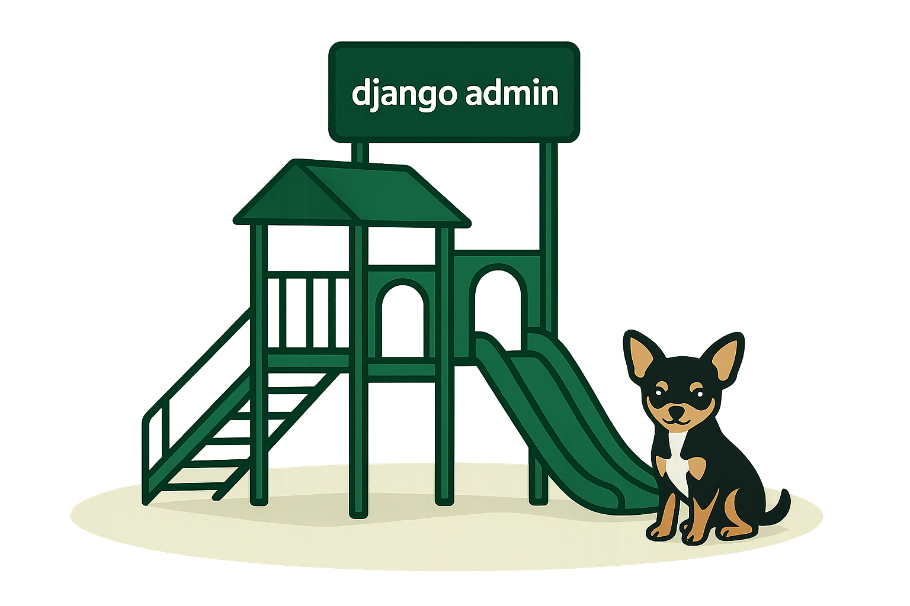

<!-- ABOUT THE PROJECT -->

# django-admin-playground

This project provides an optimal environment for contributing to Django Admin.



It provides the following features:

- Before/After Comparison Pages(Access the "/compare" path.)
- Various Admin Use Cases
- Initial Data for Testing
- Provides images for visual regression testing via screenshots (planned)

## Table of Contents

- [Running](#running)
- [Generate django docs image](#generate-django-docs-image)
- [Contributing](#contributing)

## Running

1. Clone django repo
   ```sh
   git clone https://github.com/django/django.git
   ```

2. Clone this repo into the django folder
   ```sh
   cd django
   git clone https://github.com/Antoliny0919/django-admin-playground.git
   ```

> [!WARNING]
> If you cloned django-admin-playground into a different path within the django folder,
> you need to update the values in the following files:
> - [manage.py](https://github.com/Antoliny0919/django-admin-playground/blob/main/manage.py#L12)
> - [settings.py](https://github.com/Antoliny0919/django-admin-playground/blob/main/main/settings.py#L7)

3. Create your virtual environment

   ```sh
   python -m venv venv
   source venv/bin/activate
   ```

> [!NOTE]
>
> If a virtual environment already exists in the cloned Django folder,
> you can use that environment and skip this step without any issues.

4. Install requirements
   ```sh
   pip install -r requirements.txt
   ```

5. Run migrations
   ```sh
   python manage.py migrate
   ```

6. Add initial data
   ```sh
   python manage.py loaddata auth_fixture.json changelist_fixture.json form_fixture.json inline_fixture.json docs_fixture.json
   ```

> [!TIP]
> django-admin-playground provides a superuser by default.
>
> - Username: ``admin``
> - Password: ``admin``

7. Run server 🚀
   ```sh
   python manage.py runserver
   ```

## Generate Django Docs Image

django-admin-playground provides a `makeimages` command that automatically generates the admin
related screenshots used in the official django documentation.

These screenshots are the ones referenced throughout the django docs.
For examples of where these images are used, see the following links:

- [Django Tutorial Part2](https://docs.djangoproject.com/en/5.2/intro/tutorial02/)
- [Django Tutorial Part7](https://docs.djangoproject.com/en/5.2/intro/tutorial07/)
- [ModelAdmin List Filters](https://docs.djangoproject.com/en/5.2/ref/contrib/admin/filters/)

### Arguments

`name`

The identifier of the image to generate.
You may specify multiple identifiers
```commandline
python manage.py makeimages admin01 admin02 admin03 ...
```
To see all available identifiers, use the `-s`, `--screenshot-list` option.

### Options

`-d, --output-dir`

Specifies the directory where the generated images will be saved.
Both absolute and relative paths are supported.
If the directory does not exist, it will be created automatically.

`-a, --all`

Generates all available screenshots.

`-s, --screenshot-list`

Prints a list of all available screenshot identifiers.

`--direct`

Saves the generated images directly into the django codebase documentation.
Since django-admin-playground is built on top of the django codebase and already knows the file
paths where documentation images should be stored, it can replace the existing images automatically.

`--noinput`

Skips the confirmation step before image generation.

### Preview Images

if you want to compare the images generated by django-admin-playground with the ones currently
used in the django documentation, please refer to the following document:

- [All Screenshots](screenshots/README.md)

## Contributing

- Add test cases.

   django-admin-playground welcomes values or settings that can create visual differences in the Django Admin.
   Please add a ModelAdmin or fixture with specific values that can create visual differences.
   (Refer to this [document](https://docs.djangoproject.com/en/5.2/ref/django-admin/#dumpdata) for instructions on how to add fixtures.)

- Keep Django Admin templates up-to-date.

   The [before_admin](https://github.com/Antoliny0919/django-admin-playground/tree/main/templates/before_admin) template folder must always stay up-to-date with the latest [Django Admin templates](https://github.com/django/django/tree/main/django/contrib/admin/templates/admin).
   If there are any changes in the Django Admin templates, the template files in the `before_admin` folder must be kept identical.
   If the Django Admin templates have been modified, please reflect those changes in the `before_admin` templates!

- Feature improvements

   django-admin-playground aims to create the optimal environment for contributing to Django Admin.
   If you have any ideas or items that could improve the contribution environment, don’t hesitate to create an Issue.

Finally, I would like to thank everyone who has contributed to Django and django-admin-playground ❤️
