# All Screenshots

These screenshots were generated using the following command:

```commandline
python manage.py makeimages --all
```

## admin01t.png

### Generated by django-admin-playground:

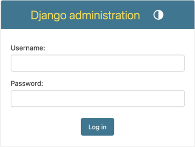

### Images currently used in the Django documentation:


## admin02.png

### Generated by django-admin-playground:

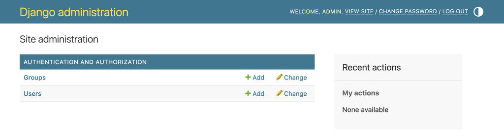

### Images currently used in the Django documentation:


## admin03t.png

### Generated by django-admin-playground:

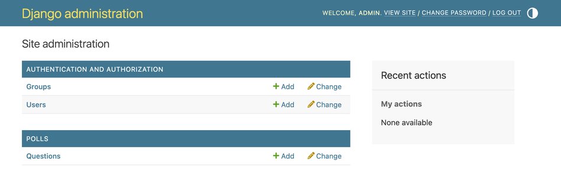

### Images currently used in the Django documentation:


## admin04t.png

### Generated by django-admin-playground:

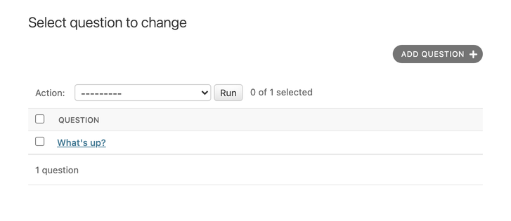

### Images currently used in the Django documentation:


## admin05t.png

### Generated by django-admin-playground:

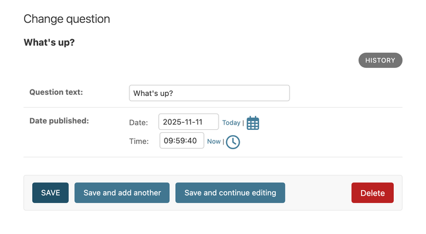

### Images currently used in the Django documentation:


## admin06t.png

### Generated by django-admin-playground:

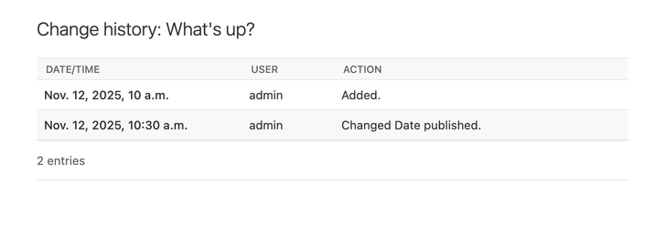

### Images currently used in the Django documentation:


## admin07.png

### Generated by django-admin-playground:

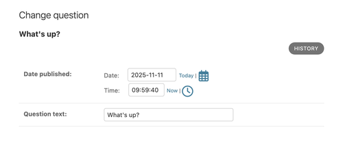

### Images currently used in the Django documentation:


## admin08t.png

### Generated by django-admin-playground:

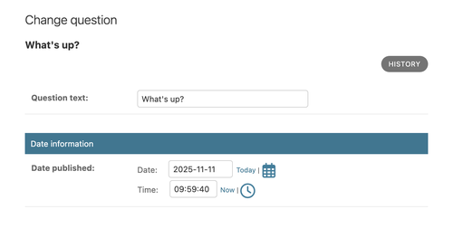

### Images currently used in the Django documentation:


## admin09.png

### Generated by django-admin-playground:

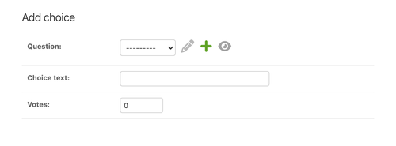

### Images currently used in the Django documentation:


## admin10t.png

### Generated by django-admin-playground:

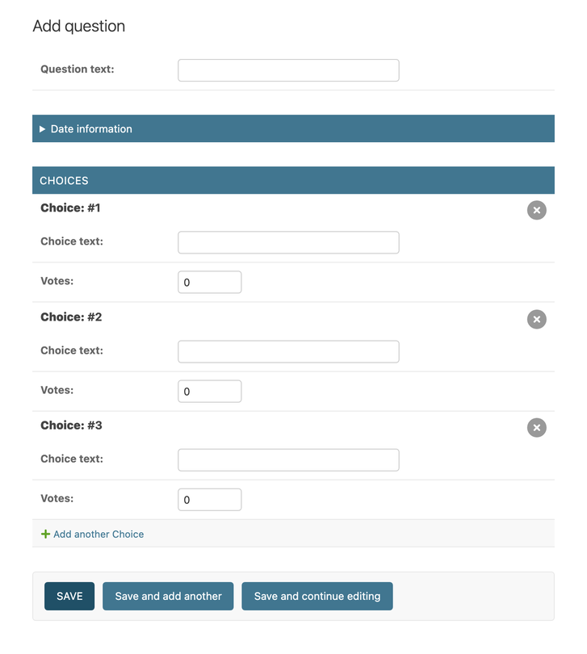

### Images currently used in the Django documentation:


## admin11t.png

### Generated by django-admin-playground:

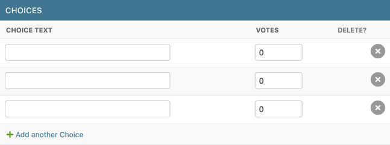

### Images currently used in the Django documentation:


## admin12t.png

### Generated by django-admin-playground:

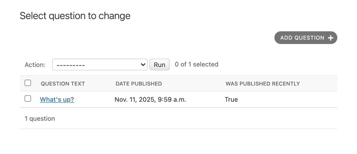

### Images currently used in the Django documentation:


## admin13t.png

### Generated by django-admin-playground:

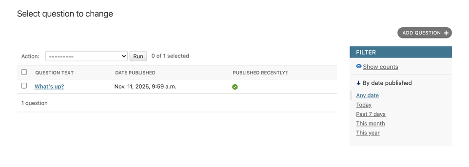

### Images currently used in the Django documentation:


## admin14t.png

### Generated by django-admin-playground:

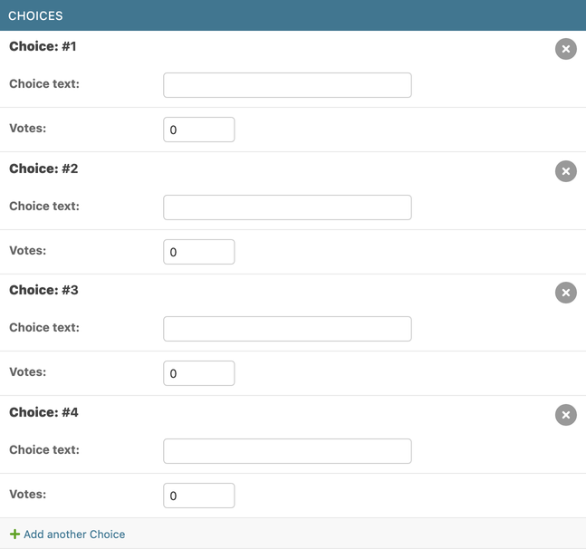

### Images currently used in the Django documentation:


## list_filter.png

### Generated by django-admin-playground:

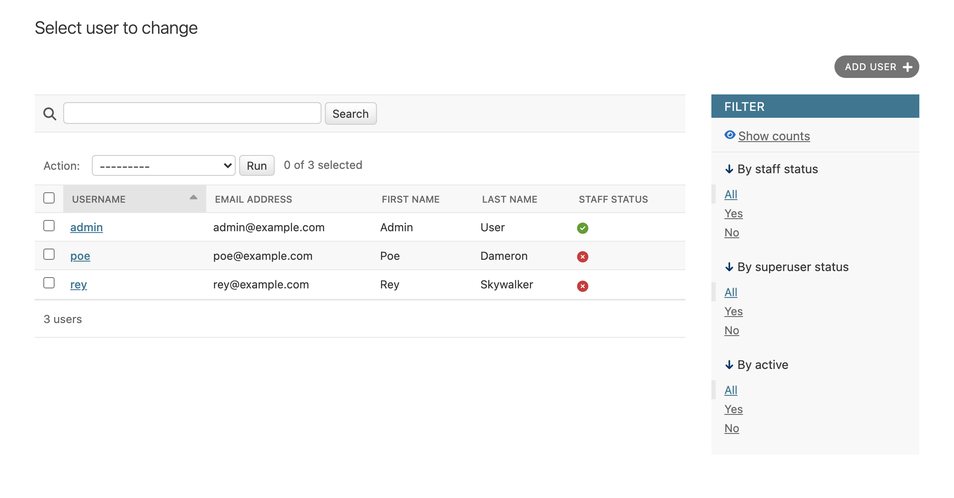

### Images currently used in the Django documentation:


